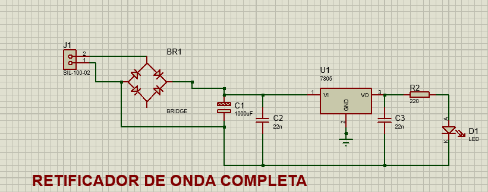
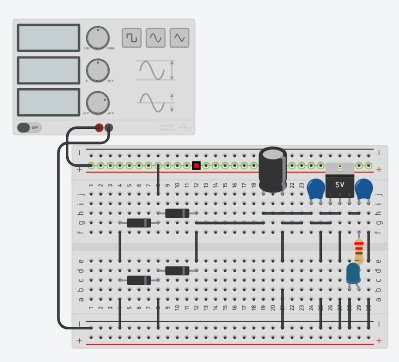

<body>
    <h1>Retificadores</h1>
    <h2>Descrição</h2>
    
Este repositório foi criado como parte de uma atividade solicitada pelo professor de sistemas embarcados. O objetivo é demonstrar os conteúdos ensinados em sala de aula por meio de um projeto prático.
     O foco do repositório é fornecer informações sobre retificadores, um tema importante e amplamente utilizado na eletrônica de potência. Serão abordados diferentes tipos de retificadores, suas aplicações e características.
     Os materiais apresentados no repositório incluirão  diagramas, explicações teóricas e experimentos práticos. O objetivo é fornecer uma visão geral completa sobre o assunto para estudantes e entusiastas de eletrônica.

    <h2>O que é um Retificador?</h2>
    
Um retificador é um circuito eletrônico que converte uma corrente alternada (AC) em corrente contínua (DC). Ele é amplamente utilizado em sistemas de eletrônica de potência, como fontes de alimentação para dispositivos eletrônicos.
     Os retificadores são projetados para permitir que a corrente elétrica flua em uma única direção, eliminando a parte negativa do ciclo de onda da corrente alternada e deixando apenas a parte positiva, produzindo assim uma forma de onda pulsante de corrente contínua. Esse processo é conhecido como retificação e pode ser realizado por meio de diferentes tipos de circuitos retificadores, como retificadores de meia onda, retificadores de onda completa e retificadores em ponte. Os retificadores são amplamente utilizados em várias aplicações, incluindo eletrônica industrial, sistemas de controle de motor, sistemas de alimentação de energia, entre outros. Além disso, eles são usados em dispositivos eletrônicos de consumo, como TVs, aparelhos de som, computadores e carregadores de celular.
     Em resumo, os retificadores são componentes importantes na eletrônica de potência, responsáveis por converter a corrente alternada em corrente contínua para alimentar dispositivos eletrônicos.

    <h2>Tecnologias Utilizadas</h2>
    <ul>
      <li>Proteus 8 Professional - Diagramas</li>
      <li>Tinker Cad - Simulação</li>
    </ul>
    <h2>Diagramas de Retificadores</h2>
    <h4 align='center'>Diagrama com Ponte</h4>
    
    <h4 align='center'>Diagrama com Ponte feita com diodos separados</h4>
    <h4></h4>
    <h4 align='center'>Esquemático Tinker</h4>
    <h4></h4>
</body>

